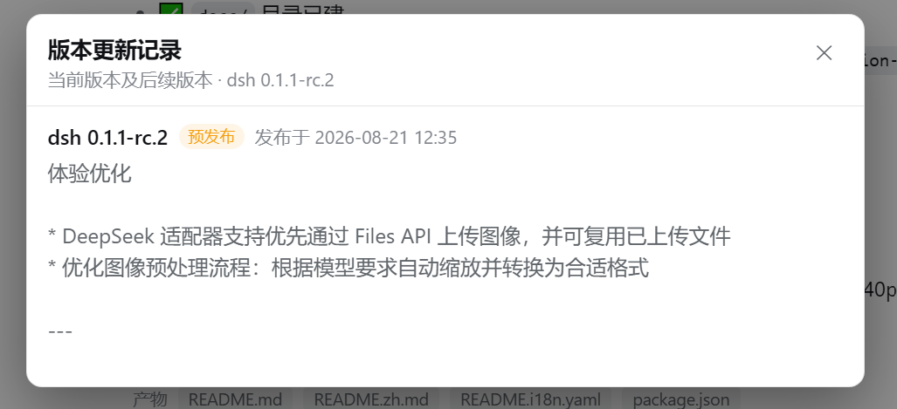

# @deepseek-ai/dsh-client-ui-version-check

[English](README.md) | 中文

> **升级提示：0.1.0 在 dsh >= 0.1.5 上已失效，请更新到 0.2.0。**
> dsh 0.1.5 移除了本插件依赖的 `apiProxy` 服务与带点号的 `/api/host.describe` 路由，悬停 Logo 只会看到 `dsh 版本 …` 和「获取最新版本失败」。0.2.0 改用插件自有的 `/api/dsh-version-check` 路由（旧路由保留为回退），并修正了 rc / 通道版本的「最新版本」判断。详见下文「升级与修复说明」。

将鼠标悬停在左上角品牌 Logo 上，浮动显示已安装的 dsh 版本与可更新版本，并可通过居中的模态窗查看当前版本及后续版本的更新记录。这是一个双面插件：宿主半通过自有的 `/api/dsh-version-check` 路由提供真实已装版本与最新发布版本；客户端半渲染非侵入的悬停浮层与模态窗，**零外部 CSS 依赖**（内置样式表，全部使用 dsh 主题 token）。

## 升级与修复说明（0.1.0 → 0.2.0）

### 症状

dsh 升级到 **0.1.5 及以上**后，0.1.0 版插件仍然弹出浮层，但两条数据都取不到：

```
dsh 版本      …
可更新版本    获取最新版本失败
```

浏览器网络面板里 `POST /api/host.describe` 返回 **404**（控制台报 `Failed to load resource: 404`）。浮层的「刷新」「详情」按钮、详情模态窗本身都还正常——坏的只是数据通路。

### 根因

1. **旧端点被移除**：客户端一直裸 POST `/api/host.describe`。dsh 0.1.5 把共享 `/api` 通道的端点改为 `<namespace>/<method>` 形式（如 `settings/describe`），带点号的 `host.describe` 路由随之消失 → 404 → 客户端拿不到任何版本数据。
2. **宿主半静默失效**：宿主半靠 `ctx.inject(["apiProxy"], …)` 运行时包装 `apiProxy.host.describe` 来补充 `version` / `latestVersion`。0.1.5 起核心不再提供 `apiProxy` 服务，注入永不触发，插件字段从未写入（旧版本靠它绕过核心客户端 schema 的字段剥离）。
3. **附带缺陷（版本比较）**：旧代码只查 npm 的 `latest` dist-tag，并用字符串相等判断是否有更新。当发布通道为 `latest=0.1.5-rc.1`、`next=0.1.5-rc.2`、`alpha=0.1.6-alpha.1` 时，一台装着 `next` 版 0.1.5-rc.2 的机器会被显示成「有新版本可更新 → 0.1.5-rc.1」——实际上那是降级。

### 修复内容

- **宿主半**（`lib/index.js`）：在共享 `/api` 通道上注册插件自有的精确 Fetch 路由 **`/api/dsh-version-check`**（`ctx.connection.fetch.register`，注册作用域绑定本插件，插件重载时自动注销），返回标准的 `client-request` / `server-response` 信封；旧版 ≤ 0.1.4 的 `apiProxy` 包装保留为兼容分支。
- **最新版本语义**：改读 registry 的 **dist-tags**，在全部 tag 中取最新版本并附带承载它的 tag（回退 `/latest`）；registry 顺序为「用户配置的 → 官方源 → npmmirror」，10 分钟 TTL、每个候选 2.5 秒超时、请求去重。
- **客户端半**（`lib/client.js`）：按顺序尝试 `/api/dsh-version-check` → `/api/host.describe`；更新状态改为 **semver 比较**而非相等判断；显示发布通道（如 `0.1.6-alpha.1 (alpha)`）；已装版本读不到时显示「无法读取已装版本」，不再退回假的 `0.0.1`。
- **已装版本解析**：先走模块解析（`@deepseek-ai/dsh/package.json`），再回退到正在运行的 CLI 入口（`…/@deepseek-ai/dsh/lib/bin.js` 的上级目录），两者都无法确认时返回 `null`。

### 升级与生效步骤

1. 取得 0.2.0 的文件：上游发布版、工作区源码副本，或把 profile 的依赖改成 `link:` 指向本地源码。
2. 覆盖 profile 里的插件目录（例如 `$DSH_HOME/profiles/node_modules/@deepseek-ai/dsh-client-ui-version-check`），或直接 `dsh plugin --profile web add link:<本地路径>` 改用链接依赖。
3. **重启 `dsh web`**（见下方「生效边界」——宿主半改动必须重启）。
4. 验证：设置里的**插件清单**显示 `…dsh-client-ui-version-check 0.2.0`；悬停 Logo 能看到真实版本与最新版本；网络面板里 `POST /api/dsh-version-check → 200`。

### 生效边界：哪一半需要重启

| 改动 | 谁加载它 | 如何生效 |
| --- | --- | --- |
| `lib/client.js`（客户端半） | dsh-client-modules 快照后提供给浏览器 | **不需要重启**：`dsh-client-hmr` 以 500ms 轮询每个已注册 bundle 的 mtime/size，一旦变化就 `clientModules.rebuilt(id)` 重新快照并生成新 `rev`，再通过 `/plugins/events` SSE 让浏览器热替换（实测 combo `rev` 由 `04e32111eefc` 变为 `3e1dfa843950`）；没有该插件时，bundle 内容是启动时快照，必须重启才更新 |
| `lib/index.js`（宿主半） | dsh web 进程启动时 import | **必须重启 dsh web**：profile 的 `hmr` 行默认 `disabled: true`，`patchReload: live` 只重载配置、不重载代码 |

本插件是双面插件，所以**按宿主半的标准执行：升级后重启一次**。只重启不换文件（或只换文件不重启）都会停留在「获取最新版本失败」。

## 截图



详情模态窗展示当前已装版本及后续版本的更新记录（含中英双语摘要），并随宿主 UI 主题自动适配。

## 功能

- **悬停浮层**（左上角品牌 Logo）：`dsh 版本` + `可更新版本` + 更新状态（有新版本可更新 / 已是最新 / 获取最新版本失败）。
- **刷新按钮**：绕过 60 秒客户端缓存，重新请求 `/api/dsh-version-check`。
- **详情模态窗**：调用 GitHub releases API（CORS 开放），过滤出当前已装版本及后续版本（新→旧），提取每个 release 的中文与英文更新摘要，在居中的主题化模态窗中展示。可通过右上角关闭按钮、点击遮罩或按 Esc 关闭。
- **摘要内链接可点击**：更新摘要中的原始 HTML 链接、markdown 链接与裸 http(s) URL 会渲染为可点击链接，点击后在新标签页打开（`rel="noopener noreferrer"`）。其余内容一律以纯文本渲染——脚本、样式、图片与表单会被丢弃，第三方 release body 无法向宿主页面注入内容或发起任何请求。
- **主题原生适配**：所有颜色使用 dsh 设计 token（`--dsw-alias-*`、`--dsw-static-amber-*`），自动跟随浅色/深色主题；字号继承宿主 body，并通过 `em` 等比缩放。

## 非侵入设计

- **不注册任何核心槽位**——侧边栏品牌槽位仍归官方品牌插件所有。
- 通过 DOM 观察定位品牌按钮（结构特征：`button[aria-label="新建会话"/"New session"]` 且首个子元素是含嵌套 span 的 span——「新建会话」按钮的首个子元素是 SVG 图标，两者不会混淆）。
- 浮层与模态窗均为 `position: fixed` 元素，挂载于 `document.body`，避开侧边栏列的 overflow 裁剪。
- 版本数据通过原始 POST 请求插件自有的 `/api/dsh-version-check` 路由获取（dsh <= 0.1.4 时回退到旧的带点号 `/api/host.describe`），绕过核心客户端 schema 的字段剥离，带 60 秒缓存。

## 宿主半

按现代优先的顺序提供两种传输：

- **dsh >= 0.1.5** —— 插件在共享 Connection `/api` 通道上占有一条精确 Fetch 路由 `/api/dsh-version-check`（`ctx.connection.fetch.register`）。该通道改用 `<namespace>/<method>` 形式的 Typert 端点后，核心同时移除了 `apiProxy` 服务与带点号的 `host.describe` 路由——这正是 0.1.5 上旧机制静默失效的原因。
- **dsh <= 0.1.4** —— 在运行时包装 `apiProxy.host.describe`，把相同字段合并进其响应。

两种传输上报同一份数据：

- `version`：真实已装版本，读取自 `@deepseek-ai/dsh/package.json`（先走模块解析，再回退到正在运行的 CLI 入口）；两者都无法确认为本包时返回 `null`。
- `latestVersion` + `latestTag`：全部 npm dist-tag 中最新发布的版本，以及承载它的 tag。优先用户配置的 registry，其次官方源，镜像作为兜底；10 分钟 TTL、每个候选 2.5 秒超时、请求去重。只看 `latest` tag 并不够——从 `next`/`alpha` 安装的版本可能比 `latest` 更新——因此浮层用版本比较而非相等判断。
- 失败返回 `null`，绝不破坏响应。

完全不触碰核心包。

## 安装

本包同时承载两个面（`main` = 宿主半，`exports["./client"]` = 客户端半，`dsh.client.platform: "web"`）。安装到 web profile 的 node_modules，并通过 profile 的插件补丁文件（如 `cordis.patch.yml`）注册：

```yaml
- insert:
    - id: ui-version-check
      name: '@deepseek-ai/dsh-client-ui-version-check'
```

首次新增插件需重启服务器（plugin-set 变化要重启才进入 loader）。此后的内容更新：**宿主半改动需重启**，客户端半改动由 `dsh-client-hmr` 自动热替换（或浏览器 Ctrl+F5 取新 `rev`），详见上方「生效边界」。

## 模型体验

无；插件仅提供一个版本端点，并在浏览器中读取 GitHub releases API，不触达任何模型请求。

#### KV Cache 影响

无；本包既不组装也不发送任何 provider 请求。

## 已知限制与待办

- **最新版本查询仅在宿主侧**——客户端只渲染宿主端点返回的内容；在 dsh >= 0.1.5 上，该端点仅在本插件加载期间存在（dsh <= 0.1.4 的上游 `host.describe` 占位版本已不复存在）。
- **更新记录来自 GitHub**——离线或 CORS 受限环境下显示「无法获取更新摘要」并提供重试按钮。
- **品牌按钮检测依赖结构**——通过 `aria-label` + 嵌套 span 形状定位侧边栏品牌按钮；未来布局变化可能需要更新 `isBrandButton`。
- **已安装副本不是不可变的**——客户端 bundle 的热替换只依据文件 mtime/size 变化，任何能改写该文件的进程都会让浏览器在约 1 秒内加载新代码。
- **待办**——将纯文本摘要提取升级为完整的 markdown 更新记录渲染。
